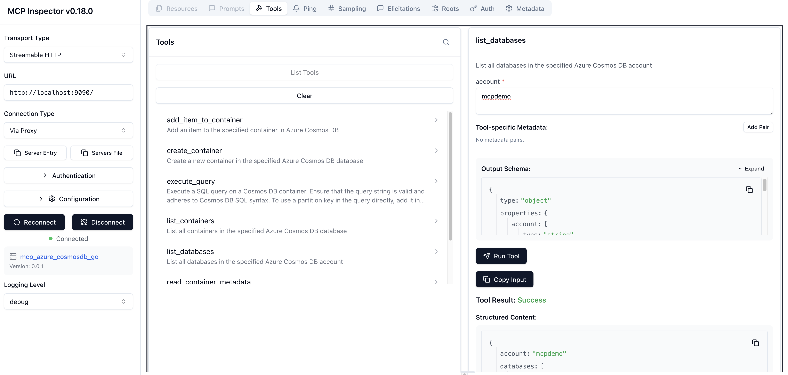

# Go based implementation of an MCP server for Azure Cosmos DB

This is a Go based implementation of an MCP server for Azure Cosmos DB using the [Azure SDK for Go](https://pkg.go.dev/github.com/Azure/azure-sdk-for-go/sdk/data/azcosmos) and the official [MCP Go SDK](https://github.com/modelcontextprotocol/go-sdk). 

It exposes the following tools for interacting with Azure Cosmos DB:

- **List Databases**: Retrieve a list of all databases in a Cosmos DB account.
- **List Containers**: Retrieve a list of all containers in a specific database.
- **Read Container Metadata**: Fetch metadata or configuration details of a specific container.
- **Create Container**: Create a new container in a specified database with a defined partition key.
- **Add Item to Container**: Add a new item to a specified container in a database.
- **Read Item**: Read a specific item from a container using its ID and partition key.
- **Execute Query**: Execute a SQL query on a Cosmos DB container with optional partition key scoping.

This project is not intended to replace the [Azure MCP Server](https://github.com/azure/azure-mcp) or [Azure Cosmos DB MCP Toolkit](https://github.com/AzureCosmosDB/MCPToolKit). Rather, it serves as an experimental **learning tool** that demonstrates how to combine the Azure Go SDK and MCP Go SDK Cosmos DB to build AI tooling for Azure Cosmos DB.

▶️ Here is a demo using [Agent Mode in Visual Studio Code](https://code.visualstudio.com/docs/copilot/chat/chat-agent-mode) (opens video):

[](https://abhirockzz.github.io/videos/mcp_server_demo.mp4)

## 🚀 How to run

> Large Language Models (LLMs) are non-deterministic by nature and can make mistakes. **Always validate** the results and queries before making any decisions based on them.

This MCP server supports both Streamable HTTP and Stdio transports.

To start with, clone the GitHub repo and build the binary:

```bash
git clone https://github.com/abhirockzz/mcp_cosmosdb_go
cd mcp_cosmosdb_go

go build -o mcp_azure_cosmosdb_go main.go
```

**Note**: The MCP server uses the [DefaultAzureCredential](https://learn.microsoft.com/en-us/azure/developer/go/sdk/authentication/credential-chains#defaultazurecredential-overview) implementation from the Azure SDK for Go to authenticate with Azure Cosmos DB. This means that you can authenticate using various methods, including environment variables, managed identity, or Azure CLI login, among others.

### 💻 Local

Thanks to Streamable HTTP support, you can easily run this MCP server as an HTTP server locally on your machine.

Login using Azure CLI ([az login](https://learn.microsoft.com/en-us/cli/azure/authenticate-azure-cli)), or the Azure Developer CLI ([azd auth login](https://learn.microsoft.com/en-us/azure/developer/azure-developer-cli/authenticate-azure-developer-cli)). Since the MCP server uses `DefaultAzureCredential`, it will authenticate as the identity logged in to the Azure CLI or the Azure Developer CLI.

The user principal (identity) you are logged in with should have permissions ([control](https://learn.microsoft.com/en-us/azure/cosmos-db/nosql/security/how-to-grant-control-plane-role-based-access?tabs=built-in-definition%2Ccsharp&pivots=azure-interface-cli) and [data plane](https://learn.microsoft.com/en-us/azure/cosmos-db/nosql/security/how-to-grant-data-plane-role-based-access?tabs=built-in-definition%2Ccsharp&pivots=azure-interface-cli)) to execute CRUD operations on database, container, and items.

**🌐 HTTP server**

Start the server:

```bash
export COSMOSDB_MCP_SERVER_MODE=http
./mcp_azure_cosmosdb_go
```

This will start the server on port `9090` by default. You can change the port by setting the `PORT` environment variable.

Configure the server:

This will differ based on the MCP client/tool you use. For VS Code you can [follow these instructions](https://code.visualstudio.com/docs/copilot/chat/mcp-servers#_add-an-mcp-server) on how to configure this server using a `mcp.json` file.

Here is an example of the `mcp.json` configuration for the HTTP server:

```json
{
  "servers": {
    "mcp_azure_cosmosdb_go_http": {
      "type": "http",
      "url": "http://localhost:9090"
    }
  }
  //other MCP servers...
}
```

> Change the port if you have configured a different one.

**🖥️ Stdio server**

Here is an example of the `mcp.json` configuration for the `stdio` mode:

```json
{
  "servers": {
    "mcp_azure_cosmosdb_go_stdio": {
      "type": "stdio",
      "command": "./mcp_azure_cosmosdb_go"
    }
  }
  //other MCP servers...
}
```

> For other tools like Claude Code, Claude Desktop, etc., refer to their respective documentation on how to configure an MCP HTTP server.

### ☁️ Remote endpoint

You can also deploy this MCP server to any cloud service (like Azure App Service, Azure Container Apps, etc.) and expose it as an HTTP(s) endpoint. The Azure service should support Managed Identity, and the MCP server will automatically pick up the credentials using the [DefaultAzureCredential](https://learn.microsoft.com/en-us/azure/developer/go/sdk/authentication/credential-chains#defaultazurecredential-overview) implementation.

This execution mode is **not recommended** (for now). Use this only for testing or dev purposes. This is because, although MCP server can access Cosmos DB securely using Managed Identity, but it **does not** implement client-side authentication and authorization yet. Anyone who can access the endpoint can execute operations on your Cosmos DB account.

## 🧪 Local dev and testing

Use [MCP inspector](https://modelcontextprotocol.io/docs/tools/inspector) - `make mcp_inspector`


