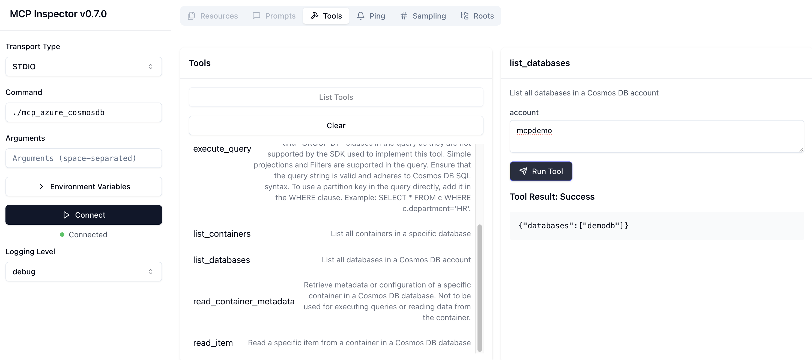

# MCP server for Azure Cosmos DB using the Go SDK

This is a sample implementation of a MCP server for Cosmos DB built using its [Go SDK](https://pkg.go.dev/github.com/Azure/azure-sdk-for-go/sdk/data/azcosmos). [mcp-go](https://github.com/mark3labs/mcp-go) project has been used as the MCP Go implementation.

This MCP server exposes the following tools for interacting with Azure Cosmos DB:

- **List Databases**: Retrieve a list of all databases in a Cosmos DB account.
- **List Containers**: Retrieve a list of all containers in a specific database.
- **Read Container Metadata**: Fetch metadata or configuration details of a specific container.
- **Create Container**: Create a new container in a specified database with a defined partition key.
- **Add Item to Container**: Add a new item to a specified container in a database.
- **Read Item**: Read a specific item from a container using its ID and partition key.
- **Execute Query**: Execute a SQL query on a Cosmos DB container with optional partition key scoping.

Here is a demo (recommend watching at 2x speed 😉) using [VS Code Insiders in Agent mode](https://code.visualstudio.com/blogs/2025/02/24/introducing-copilot-agent-mode):

[](https://www.youtube.com/watch?v=CsM-mspWJeM)

## How to run

```bash
git clone https://github.com/abhirockzz/mcp_cosmosdb_go
cd mcp_cosmosdb_go

go build -o mcp_azure_cosmosdb main.go
```

Configure the MCP server:

```bash
mkdir -p .vscode

# Define the content for mcp.json
MCP_JSON_CONTENT=$(cat <<EOF
{
  "servers": {
    "CosmosDB Golang MCP": {
      "type": "stdio",
      "command": "$(pwd)/mcp_azure_cosmosdb"
    }
  }
}
EOF
)

# Write the content to mcp.json
echo "$MCP_JSON_CONTENT" > .vscode/mcp.json
```

## Azure Cosmos DB RBAC permissions and authentication

- The user principal you will be using should have permissions ([control](https://learn.microsoft.com/en-us/azure/cosmos-db/nosql/security/how-to-grant-control-plane-role-based-access?tabs=built-in-definition%2Ccsharp&pivots=azure-interface-cli) and [data plane](https://learn.microsoft.com/en-us/azure/cosmos-db/nosql/security/how-to-grant-data-plane-role-based-access?tabs=built-in-definition%2Ccsharp&pivots=azure-interface-cli)) to execute CRUD operations on database, container, and items.
- Authentication

  - Local credentials - Just login locally using Azure CLI ([az login](https://learn.microsoft.com/en-us/cli/azure/authenticate-azure-cli)) and the MCP server will use the [DefaultAzureCredential](https://learn.microsoft.com/en-us/azure/developer/go/sdk/authentication/credential-chains#defaultazurecredential-overview) implementation automatically.
  - Or, you can set the `COSMOSDB_ACCOUNT_KEY` environment variable in the MCP server configuration:

  ```json
  {
    "servers": {
      "CosmosDB Golang MCP": {
        "type": "stdio",
        "command": "/Users/demo/mcp_azure_cosmosdb",
        "env": {
          "COSMOSDB_ACCOUNT_KEY": "enter the key"
        }
      }
    }
  }
  ```

You are good to go! Now spin up VS Code Insiders in Agent Mode, or any other MCP tool (like Claude Desktop) and try this out!

## Local dev/testing

Start with [MCP inspector](https://modelcontextprotocol.io/docs/tools/inspector) - `npx @modelcontextprotocol/inspector ./mcp_azure_cosmosdb`


